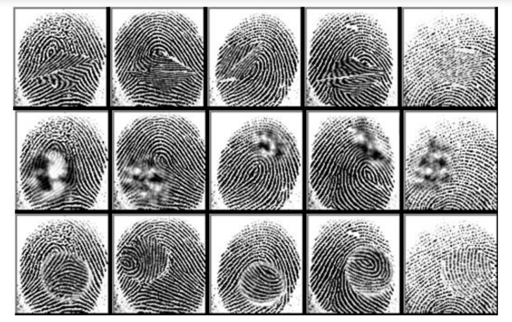

# 指纹验证(fingerprint verifcation)
## 一、介绍
指纹识别即对人体指纹进行识别，该任务有两种理解方式：

1. 由于标签离散，将指纹识别理解为分类任务(classification)，采用one-hot编码和交叉熵损失函数测度，这种方式针对封闭的指纹分类系统，模型训练好不能增加人数。 
2. 将指纹识别理解成图像检索任务(image retrieval)，即给定两张指纹图片(其中一张是咨询(query)图片)，输出它们的相似性测度。这是指纹识别常用的方式，可以随时增减人，常用于指纹验证(fingerprint verification)系统和指纹检索系统。

本仓库分别用[深度学习](deep-learning.md)和[传统方法](traditional-method.md)实现第二种指纹验证，

## 二、数据集
本次实验采用2018年发布的Sokoto Coventry指纹识别数据集(SOCO-Fing)[1]。SOCO-Fing的原始图片600名非洲人的6000张指纹图片组成(4000训练，1000验证，1000测试)。除原始图片外，该数据集还对图片进行了数据扩充，包括Z字切割、湮没和中心旋转(如下图所示)。这些变换将任务分成了简单、中等、难三个层级，数据集总共55273张指纹图片。

SOCO-Fing数据集 [https://www.kaggle.com/ruizgara/socofing/home](https://www.kaggle.com/ruizgara/socofing/home)。

## 三、参考资料
[1] Shehu Y I , Ruiz-Garcia A , Palade V , et al. Sokoto Coventry Fingerprint Dataset[J]. 2018.
