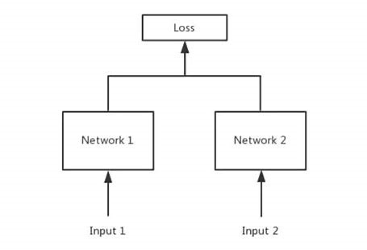
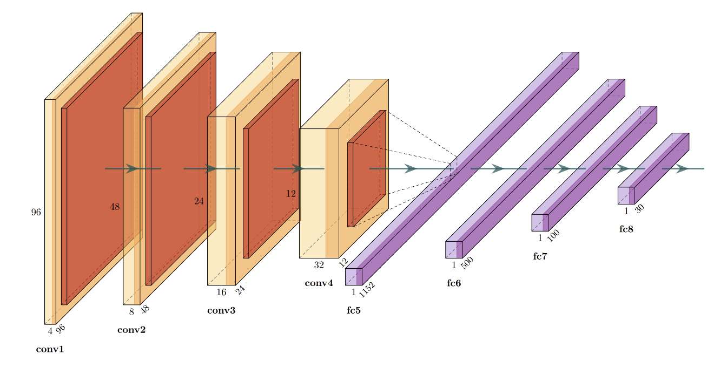
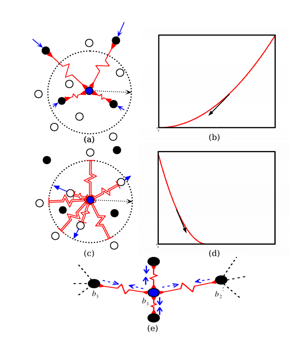
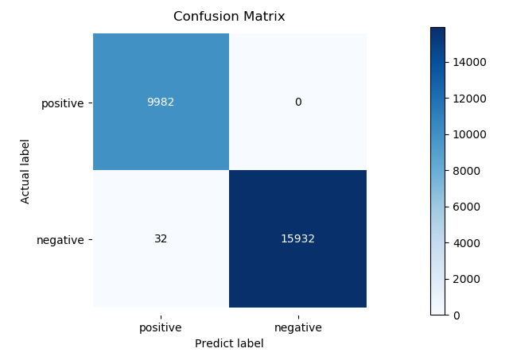
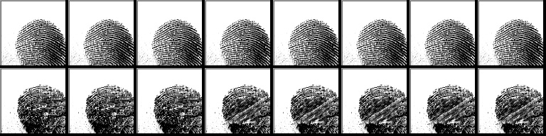
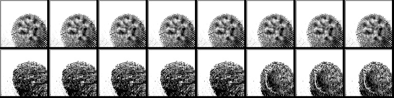
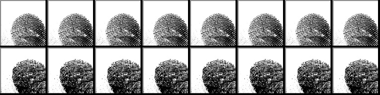

# 指纹验证(fingerprint verifcation)
## 一、介绍
指纹识别即对人体指纹进行识别，该任务有两种理解方式：

* 由于标签离散，将指纹识别理解为分类任务(classification)，采用one-hot编码和交叉熵损失函数测度，这种方式针对封闭的指纹分类系统，模型训练好不能增加人数。 
* 将指纹识别理解成图像检索任务(image retrieval)，即给定两张指纹图片(其中一张是咨询(query)图片)，输出它们的相似性测度。这是指纹识别常用的方式，可以随时增减人，常用于指纹验证(fingerprint verification)系统和指纹检索系统。

本仓库实现第二种方式。

## 二、数据集
本次实验采用2018年发布的Sokoto Coventry指纹识别数据集(SOCO-Fing)[1]。SOCO-Fing的原始图片600名非洲人的6000张指纹图片组成(4000训练，1000验证，1000测试)。除原始图片外，该数据集还对图片进行了数据扩充，包括Z字切割、湮没和中心旋转(如下图所示)。这些变换将任务分成了简单、中等、难三个层级，数据集总共55273张指纹图片。

SOCO-Fing数据集 [https://www.kaggle.com/ruizgara/socofing/home](https://www.kaggle.com/ruizgara/socofing/home)。

## 三、模型
本次实验使用Siamese网络架构，构造正负样本对进行训练，将样本嵌入(embedding)到一个度量空间，使得相同语义(同一人的同一手指指纹)的样本靠近，不同语义的样本远离。

网络具体架构如下图所示，由4层卷积池化层加4层全连接层构成。其中每次卷积都采用3 x 3卷积核，s = 1, p = 2。卷积层都采用CBR结构(Conv + BN + ReLU)，
池化操作为平均池化(k = 2, s = 2, p = 0)，最终通过全连接层将数据嵌入到一个30维的向量空间中。

## 四、损失函数
损失函数采取了LeCun于2006年提出的对比损失函数(Contrastive Loss Function)[2]，该损失函数的设计思想是：

* 近似样本之间的距离越小越好。
* 不相似样本之间的距离如果小于m，则相互排斥使其距离接近m。

可以用下图形象地表示该损失函数的作用效果。

## 五、结果

用测试数据(9982正样本对，15964个负样本对)对模型进行评估，得到PR曲线如下所示。可以看到查准率(Precision)在不同查全率(Recall)上都是100%。说明正样本对和负样本对距离之间存在一个界(margin)，正负样本之间不存在交叠的情况。当取距离大于1.148为负样本、距离小于1.148为负样本时可以完美地分离测试集正负样本(precision=100%, recall=100%)。

取阈值为1.99模型对应混淆矩阵如下所示：

其中Precision = 99.87%， Recall=100%, Accuracy = 99.87%。以下是将负样本对错分成正样本对的32个样本对：

<h6 align="center">FP样本对</h6>

可以看到这些错分为正样本的指纹对在空间分布上具有较高的一致性，说明Siamese网络提取到了指纹空间分布的信息，此外可以发现这些错分的指纹对中至少有一方是包含噪声的，说明模型可能被噪声干扰，稳定性可以通过数据增强技术进一步提高。

**补充**：本次实验还使用了基于传统模式识别的指纹识别算法，可以在[traditonal-method.md](./traditional-method.md)中查看

## 六、参考资料
[1] Shehu Y I , Ruiz-Garcia A , Palade V , et al. Sokoto Coventry Fingerprint Dataset[J]. 2018.

[2] [Dimensionality Reduction by Learning an Invariant Mapping](http://yann.lecun.com/exdb/publis/pdf/hadsell-chopra-lecun-06.pdf), 2006, Raia Hadsell, Sumit Chopra, Yann LeCun

