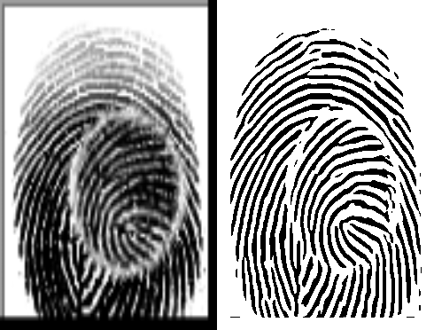

# 传统指纹识别方法

## 一、介绍

传统指纹识别算法步骤为：

* 指纹图像增强 

* 二值化
* 细化 
* 提取特征点，计算特征点描述子 
*  匹配

这五步符合传统模式识别的标准流程——数据预处理、提取特征、分类。

## 二、具体过程

首先对指纹图像进行归一化，然后进行脊线方向场计算，进行Gabor滤波增强，二值化得到二值图像，最终效果如下图所示：

<h6 align='center'>原图与二值化图像对比</h6>

接着从二值化图像中提取Harris角点，并计算Harris角点的ORB特征描述子，并进行特征匹配。最后使用距离判别条件——若匹配特征描述子之间的平均距离小于一个阈值则认为匹配成功，否则则认为失败。

<h6 align='center'>特征点匹配</h6>